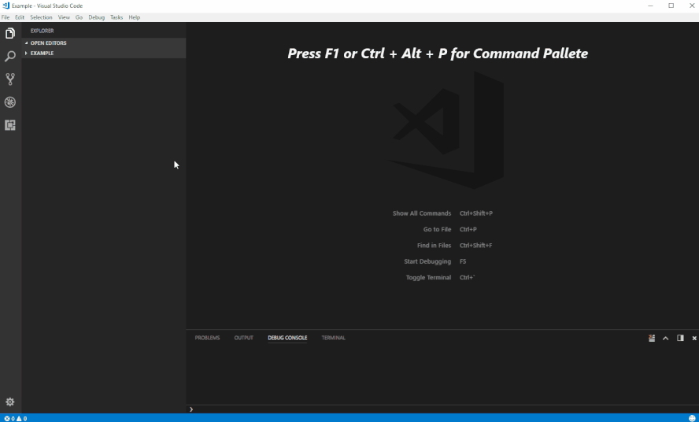

# **D**otnet **T**emplate **G**enerator

---

## Table of Contents
* [What is **DTG**?](#what-is-DTG)
* [Features](#features)
* [Prerequisite](#prerequisite)
* [Install the extension](#install-the-extension)
    * [Visual studio code marketplace](#visual-studio-code-marketplace)
* [How to Use DTG?](#how-to-use-DTG)
    * [Create New Project](#Create-New-Project)
    * [Add Reference](#Add-Reference)
    * [Set Startup Project](#Set-Startup-Project)
    * [Publish](#Publish)
* [Contribute](#contribute)
* [License](#license)

---

### **What is DTG?**
**DTG is a visual studio code extension that creates .Net core,standard templates and can Add Reference, Publish, Set Startup Project**

---

### **Features**
- DTG creates .Net core and standard templates.

- DTG adds Project reference and Dll reference.

- DTG publish your project.

- DTG set the selected project as startup Project.

    
---

### **Prerequisite**
  - [Visual Studio code](https://code.visualstudio.com/download) 1.18 or higher.
  - [.Net core SDK](https://www.microsoft.com/net/download/windows) 2.x
  
---

### **Install the Extension**

You can install the **D**otnet **T**emplate **G**enerator from visual studio Market Place.

---

### **How to use DTG?**

- #### Create New Project
   You can create .Net Core Applications by using keyboard shortcut `ctrl+alt+N`. These are the list of templates that are generated by DTG

    - Console application
    - Class library
    - ASP.NET Core empty
    - ASP.NET Core Web App (Model-View-Controller)
    - ASP.NET Core Web App (razor)
    - ASP.NET Core with Angular
    - ASP.NET Core with React.js
    - ASP.NET Core with React.js and Redux
    - ASP.NET Core Web API
   
[]
---

- #### Add Reference
  DTG lets you add reference by using shortcut `ctrl+alt+A` . These are the list of reference types you can add
    - Project Reference.
    - Dll Reference

---

- #### Set Startup Project
   DTG lets you to select a selected project as startup project which is useful in debugging the app using c# extension. you can use keyboard shortcut `ctrl+alt+S`. 

---

- #### Publish Project
  you can Publish the project by selecting the path in the fileexplorer directly by using the shortcut `ctrl+alt+P`.
    
---

## Contribute                                         
Contributions are always welcome!
Please read the contribution guidelines [here](CONTRIBUTION.md).

---

## License

